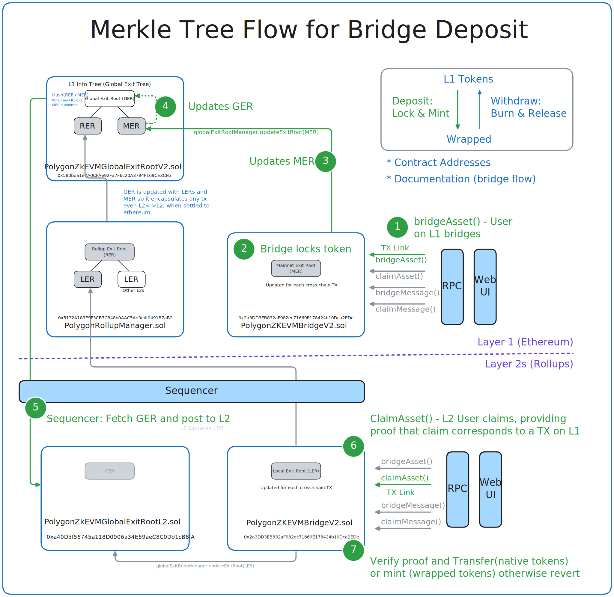

# MerkleFlow
Merkle tree flow through bridge deposit

*round2*

Round 3

# MerkleFlow
Merkle tree flow through bridge deposit

  

# MerkleFlow
Merkle tree flow through bridge deposit

<svg xmlns="http://www.w3.org/2000/svg" viewBox="0 0 100 100">
  <!-- Example SVG content -->
  <rect width="100" height="100" fill="lightblue"/>
  <a href="https://github.com/j2abro/MerkleFlow/raw/main/assets/MerkleFlow.svg">
    <text x="10" y="20" font-size="15" fill="black">Clickable Link</text>
  </a>
</svg>

